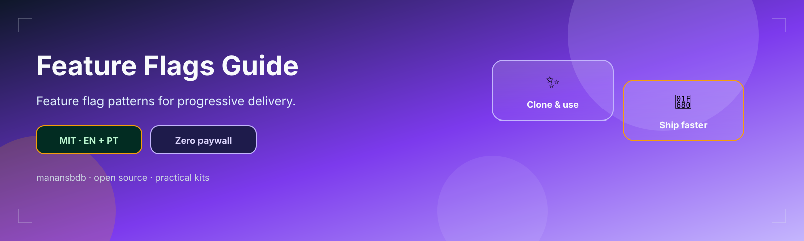
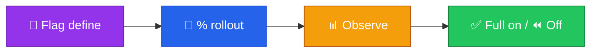

<p align="center">
  
</p>

<h1 align="center">feature-flags-guide</h1>

<p align="center">
  <strong>EN</strong> Feature-flag patterns & rollout checklist<br/>
  <strong>PT</strong> Padrões de feature flags e checklist de rollout
</p>

<p align="center">
  <a href="https://github.com/manansbdb/feature-flags-guide/blob/main/LICENSE"></a>
  
  
  <a href="#support--apoio"></a>
</p>

---

## What it does / Para que serve

| English | Português |
|---------|-----------|
| Patterns for **feature flags** (boolean, percentage, targeting) plus a rollout checklist. | Padrões de **feature flags** (boolean, percentagem, targeting) e checklist de rollout. |
| Adopt before shipping risky changes behind a toggle. | Adota antes de publicar mudanças arriscadas atrás de um toggle. |



---

## Install / Instalação

### 1) Clone / Clona

```bash
git clone https://github.com/manansbdb/feature-flags-guide.git
cd feature-flags-guide
```

### 2) Copy / Copia

```bash
mkdir -p docs/feature-flags
cp patterns.md docs/feature-flags/
cp checklist.md docs/feature-flags/
```

### Requirements / Requisitos

- `git`
- Optional: self-hosted Unleash, GrowthBook, or a homemade flag store (no paid SaaS required)

---

## Quick start / Início rápido

```bash
git clone https://github.com/manansbdb/feature-flags-guide.git
# read patterns.md → use checklist.md on every risky release
```

---

## Contents / Conteúdos

| Path | Purpose / Função |
|------|------------------|
| `patterns.md` | Flag strategies |
| `checklist.md` | Rollout checklist |
| `SUPPORT.md` | Donations / Doações |

---

## Project layout / Estrutura

```text
feature-flags-guide/
├── docs/banner.svg
├── patterns.md
├── checklist.md
├── SUPPORT.md
└── README.md
```

---

## Support / Apoio

Bitcoin donations welcome / Doações em Bitcoin bem-vindas:

```
bc1q0qfnlnxyum9u45stzxe0a7jnhtj4j0usfkqdjw
```

See [SUPPORT.md](./SUPPORT.md).

---

## License / Licença

[MIT](./LICENSE) © 2026 manansbdb
